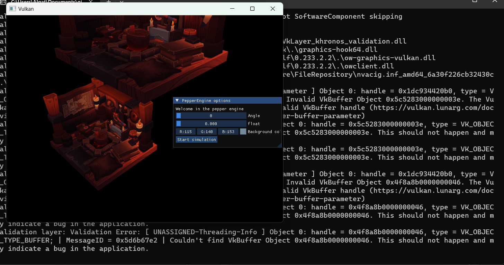

# Phase 1

## Architecture du projet

Afin de rendre le projet modulable, réutilisable, et facile à maintenir, il a été décidé de séparer les différents composants du moteur en différentes librairies internes, en limitant au strict minimum les dépendances. 
Un coding standard, améliorable en continu, a également été créé dans ce but de maintenabilité. 
Les schémas de l'architecture (brouillons, puis mise au propre quand ce sera fait) sont disponibles dans docs/graphs et sont consultables avec le logiciel draw.io.

Il a été décidé d'utiliser CMake car nous avions peu d'expérience dessus et que le maîtriser est une compétence appréciable.

La première étape a donc été de créer le projet à partir de l'exemple ImGui GLFW + Vulkan (voir la section vulkan ci-dessous) et du 
**[tutoriel officiel CMake](https:,,cmake.org,cmake,help,latest,guide,tutorial,index.html)** .

La majeure partie du code a été déplacée dans la librairie PeRender, et les fonctions graphiques sont facilement accessibles à travers le singleton CPeRenderer, mais caché derrière une couche d'abstraction.

## API Graphique Vulkan

 Pour programmer notre engin physique, nous avons choisi d'utiliser l'API graphique Vulkan étant donné sa grande compatibilité et son importance dans l'industrie du jeu vidéo actuellement. 
 Étant donné la grande complexité de cette bibliothèque graphique, nous avons choisi de partir d'un engin graphique conçu pas à pas dans un tutoriel :

 > **[Vulkan Tutorial](https:,,vulkan-tutorial.com,)**
 >
 > par [Alexander Overvoorde](https://www.linkedin.com/in/overv/?originalSubdomain=nl)

 Afin de nous aider à intégrer ImGUI avec Vulkan, nous avons utilisé le tutoriel ci-dessous :

 > **[Vulkan ImGUI](https:,,frguthmann.github.io,posts,vulkan_imgui,)**
 >
 > par [François Guthmann](https://www.linkedin.com/in/frguthmann/?originalSubdomain=fr)

 La partie graphique avec Vulkan est particulièrement complexe. Nous n'avions pour la plupart que quelques connaissances sommaires en pipeline de rendu et l'utilisation de Vulkan n'a pas rendu les choses aisées. 
 Nous avons eu d'énormes difficultés à lier le tutoriel d'Alexander Overvoorde avec l'exemple fourni par ImGUI. 

 En effet, le fonctionnement de Vulkan avec ImGUI diffère de celui avec openGL et nécessite d'intégrer directement imGUI dans le pipeline de rendu de Vulkan.

 D'autant plus que la réalisation du tutoriel Vulkan nous a demandé un temps considérable étant donné que ce dernier est particulièrement long.

 C'est pour ces diverses raisons que nous n'avons pas encore pu intégrer le rendu 3D de Vulkan à l'intérieur du projet.

 ## Classe de Vecteur3D

 Afin d'écrire notre classe de vecteur3D nous nous sommes appuyés sur le cours.
 Nous avons choisi de surcharger les opérations '=', '+', '*', '-', '+=' et '-=' pour améliorer la lisibilité de la classe (plutôt que d'avoir à écrire de longs noms de méthodes pour les calculs de base).
 Par ailleurs, puisque les opérations de produit scalaire et vectoriel peuvent être ambiguës ( '.' ou '*' ou 'x'), nous les avons implémentées dans des méthodes de classe.
 La principale difficulté rencontrée a été la sur-utilisation de pointeurs que nous avons ensuite remplacés par des références.

 ## Classe de Particules

 Pour préparer la suite du projet, notre classe CPeParticule hérite d'une classe CPeMovable indiquant qu'elle peut être déplacée physiquement.
 La classe mère possède ainsi une référence sur une instance de la classe CPeTransform qui contient la position, l'orientation et la taille de l'objet.
 Pour l'instant (avec les particules) seule la position est utilisée.
 Le constructeur de la classe a été surchargé pour permettre de choisir ou non le 'damping' de la particule.

 ## Intégrateur

 En suivant les indications du cours, nous avons implémenté deux intégrateurs selon le niveau de précision souhaité (avec ou sans t**2).
 Une fois encore pour préparer la suite du projet, le prototype d'une fonction de somme de forces a été écrite. Son implémentation renvoie pour l'instant un vecteur (0., 0., 0.) pour être fonctionnel avec le calcul de l'accélération.
 L'accélération dépend actuellement seulement du vecteur gravité.
 La seule erreur rencontrée fut la confusion entre une instance et sa référence. Elle a été remarquée, car cela produisait des valeurs incohérentes en test.

 ## Démonstration (jeu de tir)

 Afin de démontrer le fonctionnement de la librairie de physique, nous avons réalisé un jeu de démonstration très simple, ou il faut ajuster l'angle et la force d'un tir pour envoyer un ballon sur une cible.
 Le rendu 3D avec vulkan n'étant pas encore disponible, il a été décidé de réaliser un aperçu rapide avec ImGui pour ne pas perdre de temps. 
 L'utilisation de texture avec ImGui nécessitant plus de temps (implémentation de stb par exemple), nous avons simplement dessiné le parcours de la balle à chaque lancer en utilisant les AddLines de ImGui.

 # Phase 2

 ## Partie Forces

Pour la gestion des forces, nous avons suivi la suggestion du cours pour :
- la création d'une structure ParticleForceEntry qui contient une particle et une force associée aux quelles on ajoute une durée de vie.
- la création d'une interface Force qui contient une fonction Compute qui prend en argument le pas de temps et un pointeur sur la particule qui doit recevoir la valeur.

Nous n'avons pas fait de forceGenerator, mais un singleton ForceSystem qui permet de créer les différentes forces, de les associées à des particules et qui fait la mise à jour de la boucle de physique propre aux forces.

## Partie Collision

Le système de collisions est inspiré de notre système de forces.
Nous avons créé un ColliderComponent qui est attaché aux entités pouvant subir des collisions. Celui-ci contient de plus un rayon de collision.
La classe ParticleContact contient toutes les informations sur le contact entre deux particules et les méthodes pour résoudre ce contact.
Les classes de câble et tige (CPeContactCable et CPeContactRod) modifie les comportements de base des ParticleContact.
L'implémentation de la tige nous pose encore problème : son comportement est le bon sur certains de nos tests, mais nous n'arrivons pas à garantir sa consistance.
La gestion globale des collisions est confié au singleton CPeCollisionSystem. Nous avons choisis de différencier les contacts permanents (tige et câble) des contacts de collision. Ces derniers sont détectés à chaque pas de temps puis on résout tous les contacts un à un.
La gestion des contacts au repos nous a fait reprendre notre bibliothèque mathématique pour y ajouter une méthode de calcul de projection d'un vecteur sur un autre (pour projeter la vecteur gravité sur la vélocité d'une particule).

## Partie Graphique

### Compatibilité avec ImGUI

Dans la phase 1, nous n'avions pas réussi à mettre en place Vulkan avec ImGUI. Dans cette version nous avons réussi à faire
cohabiter les deux systèmes. Nous nous sommes aidés du tutoriel suivant :

 > **[Advanced vulkan rendering tutorial | imgui | Part 1](https://www.youtube.com/watch?v=6isbso_GmUk&t=3s&ab_channel=MoriTM)**
 >
 > par [Moritz Gooth](https://github.com/Mori-TM)

### Gestion de plusieurs modèles

Une fois qu'ImGUI était mis en place, nous avons fait en sorte de pouvoir utiliser plusieurs modèles sur une même scène.
Pour ce faire, nous avons utilisé la solution proposée dans ce tutoriel :

 > **[Advanced vulkan rendering tutorial | multiple models | push constants | Part 3](https://www.youtube.com/watch?v=8AXTNMMWBGg&ab_channel=MoriTM)**
 >
 > par [Moritz Gooth](https://github.com/Mori-TM)

 Cette solution proposait notamment d'utiliser des matrices modèle passées en tant que variables uniformes aux deux shaders.
 On passe ainsi une matrice modèle pour chaque objet afin que celui-ci dispose d'une position différentes dans la scène. On a
 obtenu le résultat suivant.

 

 On a profité de cette avancée pour gérer la position et l'chelle de chaque objet pour obtenir un résult comme celui-ci :

|  |  |
|--------------------------------------|------------------------------------|
| Objet d'échelle 1/2                  | Objet d'échelle 2                  |
 
### Gestion de la caméra

Maintenant que les modèles et l'interface étaient relativement indépendants par rapport à l'engin graphique, nous pouvions
ajouter une gestion simple de la caméra. Cette dernière repose sur la manipulation de la matrice de Vue de l'engin graphique.

Nous avons d'abord conçu une petite interface `CPEViewManager` qui permet d'intéragir plus facilement avec la matrice de Vue.

Nous avons ensuite conçu un système de navigation inspiré par celui du jeu vidéo Minecraft. Les consignes pour se déplacer sont
explicitées ci-dessous :

| Action                                | Commande/Bouton (QWERTY) | Commande/Bouton (AZERTY) |
| ------------------------------------- | ------------------------ | ---------------------    |
| Activer les déplacements de la caméra | M ou Escape (QWERTY)     | , ou Escape (AZERTY)     |
| Aller vers l'avant                    | W                        | Z                        |
| Aller vers l'arrière                  | S                        | S                        |
| Aller vers la gauche                  | A                        | Q                        |
| Aller vers la droite                  | D                        | D                        |
| Monter                                | Espace                   | Espace                   |
| Descendre                             | Shift                    | Shift                    |
| Regarder vers le haut                 | Souris vers l'avant      | Souris vers l'avant      |
| Regarder vers le bas                  | Souris vers l'arrière    | Souris vers l'arrière    |
| Regarder à gauche                     | Souris vers la gauche    | Souris vers la gauche    |
| Regarder à droite                     | Souris vers la droite    | Souris vers la droite    |

- Afin de réaliser les calculs de rotation et déplacement dans cette partie graphique, nous avon sutilisé la bibliothèque **glm**. Elle nous a permis de récupérer uen interface déjà existante pour la matrice de Vue notamment.
- Afin de récupérer les Inputs de l'utilisateur, nous avons utilisé la bibliothèque **glfw** que nous utilisions déjà pour afficher la fenêtre dans laquelle s'affiche Vulkan. 

 